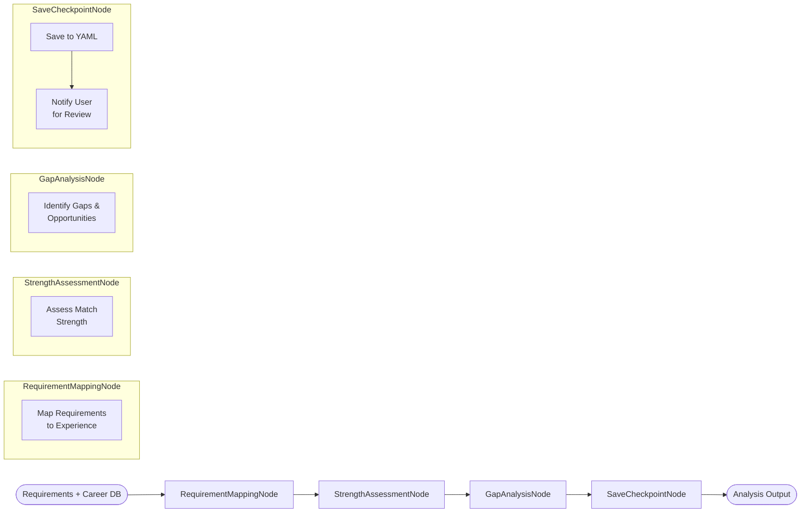
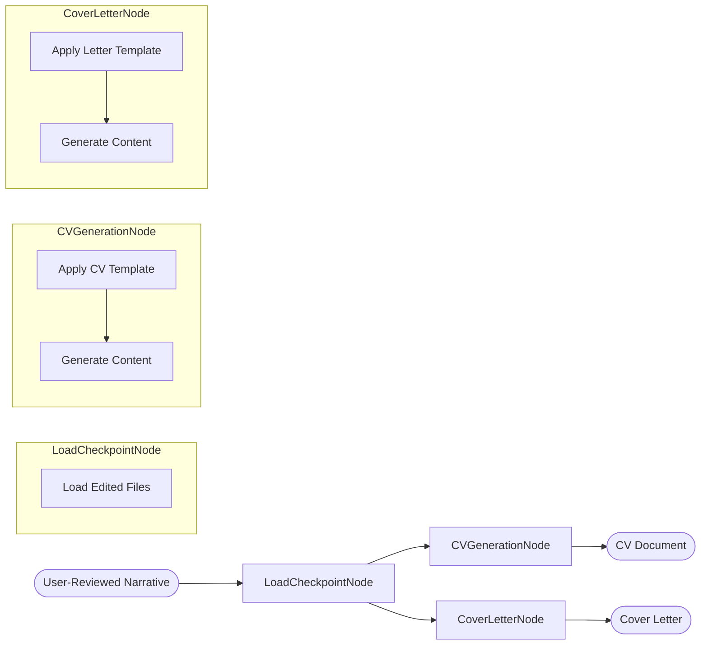

# Career Application Agent - System Workflow

## Overview

This document visualizes the complete workflow of the Career Application Agent system, showing how different flows and nodes interact to process job applications.

## High-Level System Architecture

## Detailed Flow Breakdown

### 1. Experience Database Flow (New)

### 2. Requirement Extraction Flow

### 3. Analysis Flow (With User Review)

**User Review Point**: After analysis completes, the system saves `analysis_output.yaml` and pauses for user review/editing.

### 4. Company Research Flow (AI-Browser Agent)

**Key Features**:
- Uses AI-driven headless browser for complex interactions
- Can handle dynamic content and JavaScript-heavy sites
- Navigates Google search results intelligently
- Resumes from checkpoint after user review

### 4. Assessment Flow

### 6. Narrative Flow (With User Review)

**User Review Point**: After narrative strategy completes, the system saves `narrative_output.yaml` and pauses for user review/editing.

### 7. Generation Flow

## Data Flow Through Shared Store

## Node Implementation Status

### Experience Database Building
| Node | Status | Dependencies |
|------|--------|--------------|
| ScanDocumentsNode | 🔴 Not Started | Google Drive API, File System |
| ExtractExperienceNode | 🔴 Not Started | PDF/Doc parsers |
| BuildDatabaseNode | 🔴 Not Started | Database Parser ✅ |

### Core Processing
| Node | Status | Dependencies |
|------|--------|--------------|
| ExtractRequirementsNode | 🔴 Not Started | LLM Wrapper ✅ |
| RequirementMappingNode | 🔴 Not Started | - |
| StrengthAssessmentNode | 🔴 Not Started | - |
| GapAnalysisNode | 🔴 Not Started | - |
| SuitabilityScoringNode | 🔴 Not Started | - |
| ExperiencePrioritizationNode | 🔴 Not Started | - |
| NarrativeStrategyNode | 🔴 Not Started | - |
| CVGenerationNode | 🔴 Not Started | - |
| CoverLetterNode | 🔴 Not Started | - |

### Company Research (AI Browser)
| Node | Status | Dependencies |
|------|--------|--------------|
| DecideActionNode | 🔴 Not Started | - |
| BrowserActionNode | 🔴 Not Started | Playwright/Puppeteer |
| SearchNode | 🔴 Not Started | AI Browser Tools |
| ExtractInfoNode | 🔴 Not Started | BeautifulSoup |
| CompanyAnalysisNode | 🔴 Not Started | LLM Wrapper ✅ |

### Workflow Management
| Node | Status | Dependencies |
|------|--------|--------------|
| SaveCheckpointNode | 🔴 Not Started | - |
| LoadCheckpointNode | 🔴 Not Started | - |

## Completed Components

✅ **Infrastructure**
- PocketFlow framework setup
- Career database schema (enhanced with projects)
- Database parser utility
- LLM wrapper (OpenRouter)

## Enhanced Career Database Schema

## Next Implementation Priority

Based on the updated workflow, the implementation order should be:

1. **Experience Database Builder** (New Tasks)
   - ScanDocumentsNode for Google Drive and local files
   - ExtractExperienceNode with PDF/MD parsers
   - BuildDatabaseNode to structure the data
   - This provides the foundation for all subsequent flows

2. **Workflow Management Nodes** (New Tasks)
   - SaveCheckpointNode
   - LoadCheckpointNode
   - Essential for pause/resume functionality

3. **RequirementExtractionFlow** (Tasks 5-8)
   - Design requirements YAML schema
   - Implement ExtractRequirementsNode
   - Create prompt engineering
   - Wire up the flow

4. **AnalysisFlow with Checkpoints** (Tasks 9-12)
   - RequirementMappingNode
   - StrengthAssessmentNode
   - GapAnalysisNode
   - Integrate checkpoint saving

5. **AI-Browser Research Flow** (Updated Tasks 13-18)
   - Set up Playwright/Puppeteer
   - Implement AI browser agent
   - Create search and extraction nodes

This order ensures:

- Career database is populated first
- Pause/resume capability is available early
- Each stage can be tested independently
- User can review and edit at key points